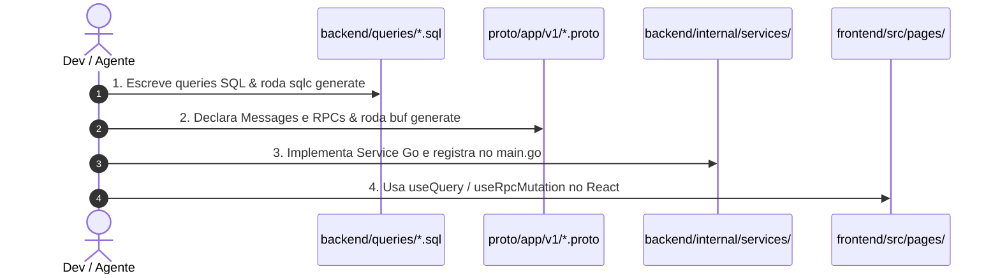

# 🚀 Universal Architecture Blueprint: Connect-RPC + SQLC + React Query

> **O padrão arquitetural definitivo para desenvolvimento Fullstack de alta performance, Type-Safety ponta a ponta e DX (Developer Experience) otimizada para Humanos e Agentes de IA.**

Este guia serve como **template e blueprint reutilizável** para iniciar qualquer novo projeto (SaaS, ERP, Fintech, E-commerce, Plataformas Internas, etc.) utilizando a combinação de:
- **Backend**: Go + PostgreSQL (`pgx/v5`) + **SQLC** (Consultas compiladas) + **Connect-RPC** (gRPC sobre HTTP/1.1 e HTTP/2).
- **Contratos**: **Protocol Buffers (Protobuf v3)** + **Buf CLI** como única fonte de verdade.
- **Frontend**: React (Vite) + TypeScript + **@connectrpc/connect-query** + **TanStack Query** + Tailwind CSS.

---

## 🧭 1. Por que esta Arquitetura?

| Desafio Tradicional (REST / ORM) | Como este Blueprint Resolve |
| :--- | :--- |
| **Divergência de Tipos** (Front e Back dessincronizados) | O contrato `.proto` gera structs Go e interfaces TypeScript com **1 comando** (`buf generate`). |
| **ORMs Lentos e Complexos** | O **SQLC** compila SQL puro para código Go nativo sem overhead em runtime e valida tipos na hora. |
| **Boilerplate de API** (Axios, Fetch, URLs manuais) | As chamadas RPC viram hooks prontos do TanStack Query: `useQuery(listItems)` e `useRpcMutation(createItem)`. |
| **Ambiguidade para Agentes de IA** | Agentes leem os schemas `.proto` e `.sql`, entendem 100% da regra e recebem feedback estático imediato do compilador. |

---

## 📂 2. Árvore de Diretórios Universal

```text
meu-projeto/
├── proto/
│   └── app/
│       └── v1/
│           ├── auth.proto             # Autenticação e Usuários
│           └── <modulo>.proto         # Entidades e RPCs do domínio
│
├── backend/
│   ├── cmd/
│   │   └── api/
│   │       └── main.go                # Servidor Go multiplexado com h2c (HTTP/2 + HTTP/1.1)
│   ├── internal/
│   │   ├── config/                    # Carregamento de variáveis de ambiente
│   │   ├── database/
│   │   │   ├── migrations/            # Scripts DDL de migração (*.sql)
│   │   │   ├── queries/               # Consultas SQL puras anotadas para o SQLC (*.sql)
│   │   │   ├── db.go                  # Pool pgx/v5 e runner de migrações
│   │   │   └── sqlc/                  # Código Go gerado pelo SQLC (NÃO EDITAR)
│   │   ├── middleware/
│   │   │   └── auth_interceptor.go    # Interceptor Unary JWT do Connect-RPC
│   │   └── services/                  # Handlers de lógica de negócio
│   │       ├── helpers.go             # Conversores universais pgtype <-> Protobuf/Go
│   │       └── <modulo>_service.go    # Implementação da interface Connect
│   ├── gen/                           # Stubs Go gerados pelo Buf (NÃO EDITAR)
│   ├── go.mod
│   └── sqlc.yaml                      # Configuração do SQLC
│
├── frontend/
│   ├── src/
│   │   ├── lib/
│   │   │   ├── transport.ts           # ConnectTransport com interceptor JWT
│   │   │   └── rpc.ts                 # Hook universal useRpcMutation
│   │   ├── gen/                       # Stubs TypeScript gerados pelo Buf (NÃO EDITAR)
│   │   ├── context/                   # AuthContext e estados globais
│   │   ├── components/                # Componentes reutilizáveis
│   │   ├── pages/                     # Páginas da aplicação React
│   │   ├── App.tsx
│   │   └── main.tsx                   # TransportProvider + QueryClientProvider
│   ├── package.json
│   └── vite.config.ts                 # Proxy para rotas Connect (/app.v1.*)
│
├── buf.yaml                           # Módulo Buf
├── buf.gen.yaml                       # Pipeline de geração de código
└── docker-compose.yml                 # PostgreSQL e serviços locais
```

---

## ⚙️ 3. Arquivos de Configuração Base (Copiar e Colar)

### `buf.yaml` (Raiz)
```yaml
version: v2
modules:
  - path: proto
```

### `buf.gen.yaml` (Raiz)
```yaml
version: v2
plugins:
  - local: protoc-gen-go
    out: backend/gen
    opt: paths=source_relative
  - local: protoc-gen-connect-go
    out: backend/gen
    opt: paths=source_relative
  - remote: buf.build/bufbuild/es
    out: frontend/src/gen
    opt: target=ts
  - remote: buf.build/connectrpc/query-es
    out: frontend/src/gen
    opt: target=ts
```

### `backend/sqlc.yaml`
```yaml
version: "2"
sql:
  - schema: "internal/database/migrations"
    queries: "internal/database/queries"
    gen:
      go:
        package: "sqlc"
        out: "internal/database/sqlc"
        sql_package: "pgx/v5"
        emit_json_tags: true
        emit_prepared_queries: false
        emit_interface: true
        overrides:
          - db_type: "uuid"
            go_type: "github.com/google/uuid.UUID"
          - db_type: "timestamptz"
            go_type: "time.Time"
```

### `frontend/src/lib/transport.ts`
```typescript
import { createConnectTransport } from "@connectrpc/connect-web";
import type { Interceptor } from "@connectrpc/connect";

const authInterceptor: Interceptor = (next) => async (req) => {
  const token = localStorage.getItem("app_token");
  if (token) {
    req.header.set("Authorization", `Bearer ${token}`);
  }
  try {
    return await next(req);
  } catch (err: any) {
    if (err?.code === 16 /* Unauthenticated */) {
      localStorage.removeItem("app_token");
      if (typeof window !== "undefined" && !window.location.pathname.includes("/login")) {
        window.location.href = "/login";
      }
    }
    throw err;
  }
};

export const transport = createConnectTransport({
  baseUrl: "", // Usa proxy do Vite em dev e Nginx em prod
  interceptors: [authInterceptor],
});
```

### `frontend/src/lib/rpc.ts` (Hook Universal de Mutation)
```typescript
import { useMutation as useConnectMutation, createConnectQueryKey } from "@connectrpc/connect-query";
import { useQueryClient } from "@tanstack/react-query";
import type { DescMethodUnary, DescMessage, MessageInitShape, MessageShape } from "@bufbuild/protobuf";

export interface RpcMutationOptions<I extends DescMessage, O extends DescMessage> {
  invalidate?: Array<DescMethodUnary<any, any> | any>;
  onSuccess?: (data: MessageShape<O>, variables: MessageInitShape<I>) => void;
  onError?: (error: Error, variables: MessageInitShape<I>) => void;
}

/**
 * Hook universal para mutations Connect-RPC com auto-invalidação de queries no TanStack Query.
 */
export function useRpcMutation<I extends DescMessage, O extends DescMessage>(
  method: DescMethodUnary<I, O>,
  options?: RpcMutationOptions<I, O>
) {
  const queryClient = useQueryClient();

  return useConnectMutation(method, {
    onSuccess: (data, variables) => {
      if (options?.invalidate && options.invalidate.length > 0) {
        options.invalidate.forEach((targetMethod) => {
          try {
            queryClient.invalidateQueries({
              queryKey: createConnectQueryKey({ schema: targetMethod, cardinality: undefined }),
            });
          } catch {
            queryClient.invalidateQueries();
          }
        });
      }
      options?.onSuccess?.(data, variables);
    },
    onError: (err: any, variables) => {
      options?.onError?.(err, variables);
    },
  });
}
```

### `backend/internal/services/helpers.go` (Conversores `pgtype`)
```go
package services

import (
	"fmt"
	"math/big"
	"time"
	"github.com/google/uuid"
	"github.com/jackc/pgx/v5/pgtype"
)

func NumericToFloat64(n pgtype.Numeric) float64 {
	if !n.Valid || n.Int == nil {
		return 0.0
	}
	f, _ := new(big.Rat).SetFrac(n.Int, new(big.Int).Exp(big.NewInt(10), big.NewInt(int64(-n.Exp)), nil)).Float64()
	return f
}

func Float64ToNumeric(val float64) pgtype.Numeric {
	var n pgtype.Numeric
	_ = n.Scan(fmt.Sprintf("%.2f", val))
	return n
}

func DateToString(d pgtype.Date) string {
	if !d.Valid {
		return ""
	}
	return d.Time.Format("2006-01-02")
}

func StringToDate(s string) pgtype.Date {
	if s == "" {
		return pgtype.Date{Valid: false}
	}
	t, err := time.Parse("2006-01-02", s)
	if err != nil {
		return pgtype.Date{Valid: false}
	}
	return pgtype.Date{Time: t, Valid: true}
}

func TimestamptzToString(t pgtype.Timestamptz) string {
	if !t.Valid {
		return ""
	}
	return t.Time.Format(time.RFC3339)
}

func UUIDToPgtype(s string) pgtype.UUID {
	if s == "" {
		return pgtype.UUID{Valid: false}
	}
	u, err := uuid.Parse(s)
	if err != nil {
		return pgtype.UUID{Valid: false}
	}
	return pgtype.UUID{Bytes: u, Valid: true}
}

func PgtypeUUIDToString(u pgtype.UUID) string {
	if !u.Valid {
		return ""
	}
	id, _ := uuid.FromBytes(u.Bytes[:])
	return id.String()
}
```

---

## 🔄 4. O Ciclo de Criação de Features em 4 Passos



### Exemplo: Módulo de Tarefas / Projetos (`TaskService`)

#### Passo 1: Query SQL (`backend/internal/database/queries/tasks.sql`)
```sql
-- name: ListTasks :many
SELECT * FROM tasks WHERE status = $1 ORDER BY created_at DESC;

-- name: CreateTask :one
INSERT INTO tasks (title, description, status)
VALUES ($1, $2, $3)
RETURNING *;
```
👉 Execute: `cd backend && sqlc generate`

---

#### Passo 2: Contrato Protobuf (`proto/app/v1/task.proto`)
```protobuf
syntax = "proto3";

package app.v1;
option go_package = "meuprojeto/backend/gen/app/v1;appv1";

message Task {
  string id = 1;
  string title = 2;
  string description = 3;
  string status = 4;
  string created_at = 5;
}

message ListTasksRequest {
  string status = 1;
}

message ListTasksResponse {
  repeated Task tasks = 1;
}

message CreateTaskRequest {
  string title = 1;
  string description = 2;
  string status = 3;
}

service TaskService {
  rpc ListTasks (ListTasksRequest) returns (ListTasksResponse);
  rpc CreateTask (CreateTaskRequest) returns (Task);
}
```
👉 Execute na raiz: `buf generate`

---

#### Passo 3: Implementação Go (`backend/internal/services/task_service.go`)
```go
package services

import (
	"context"
	"time"
	"meuprojeto/backend/gen/app/v1"
	"meuprojeto/backend/gen/app/v1/appv1connect"
	"meuprojeto/backend/internal/database/sqlc"
	"connectrpc.com/connect"
)

type TaskService struct {
	queries *sqlc.Queries
}

func NewTaskService(queries *sqlc.Queries) appv1connect.TaskServiceHandler {
	return &TaskService{queries: queries}
}

func (s *TaskService) ListTasks(
	ctx context.Context,
	req *connect.Request[appv1.ListTasksRequest],
) (*connect.Response[appv1.ListTasksResponse], error) {
	tasks, err := s.queries.ListTasks(ctx, req.Msg.GetStatus())
	if err != nil {
		return nil, connect.NewError(connect.CodeInternal, err)
	}

	protoTasks := make([]*appv1.Task, 0, len(tasks))
	for _, t := range tasks {
		protoTasks = append(protoTasks, &appv1.Task{
			Id:          t.ID.String(),
			Title:       t.Title,
			Description: t.Description,
			Status:      t.Status,
			CreatedAt:   t.CreatedAt.Format(time.RFC3339),
		})
	}
	return connect.NewResponse(&appv1.ListTasksResponse{Tasks: protoTasks}), nil
}

func (s *TaskService) CreateTask(
	ctx context.Context,
	req *connect.Request[appv1.CreateTaskRequest],
) (*connect.Response[appv1.Task], error) {
	m := req.Msg
	t, err := s.queries.CreateTask(ctx, sqlc.CreateTaskParams{
		Title:       m.GetTitle(),
		Description: m.GetDescription(),
		Status:      m.GetStatus(),
	})
	if err != nil {
		return nil, connect.NewError(connect.CodeInternal, err)
	}

	return connect.NewResponse(&appv1.Task{
		Id:          t.ID.String(),
		Title:       t.Title,
		Description: t.Description,
		Status:      t.Status,
		CreatedAt:   t.CreatedAt.Format(time.RFC3339),
	}), nil
}
```

Plugar no `backend/cmd/api/main.go`:
```go
taskService := services.NewTaskService(queries)
mux.Handle(appv1connect.NewTaskServiceHandler(taskService, interceptors))
```

---

#### Passo 4: Consumo no React (`frontend/src/pages/Tasks.tsx`)
```tsx
import React, { useState } from "react";
import { useQuery } from "@connectrpc/connect-query";
import { listTasks, createTask } from "../gen/app/v1/task-TaskService_connectquery";
import { useRpcMutation } from "../lib/rpc";

export const TasksPage: React.FC = () => {
  const [title, setTitle] = useState("");
  const [status, setStatus] = useState("pending");

  // 1. Query automática: Carregamento reativo e cacheado
  const { data, isLoading } = useQuery(listTasks, { status });

  // 2. Mutation de 1 linha com Auto-Invalidação automática
  const { mutate: addTask, isPending } = useRpcMutation(createTask, {
    invalidate: [listTasks],
    onSuccess: () => setTitle(""),
  });

  return (
    <div className="p-6 space-y-4">
      <h1 className="text-xl font-bold">Tarefas</h1>

      {isLoading ? (
        <p>Carregando...</p>
      ) : (
        <ul className="space-y-2">
          {data?.tasks.map((t) => (
            <li key={t.id} className="p-3 border rounded-lg flex justify-between">
              <span>{t.title}</span>
              <span className="text-xs uppercase font-mono">{t.status}</span>
            </li>
          ))}
        </ul>
      )}

      <form
        onSubmit={(e) => {
          e.preventDefault();
          addTask({ title, description: "", status });
        }}
        className="flex gap-2"
      >
        <input
          value={title}
          onChange={(e) => setTitle(e.target.value)}
          placeholder="Nova tarefa..."
          className="border p-2 rounded flex-1"
          required
        />
        <button type="submit" disabled={isPending} className="bg-primary text-white px-4 rounded">
          {isPending ? "Criando..." : "Adicionar"}
        </button>
      </form>
    </div>
  );
};
```

---

## ⚡ 5. Setup do Zero para um Novo Projeto (Passo a Passo)

### 1. Pré-requisitos
- **Go** $\ge$ 1.22
- **Node.js** $\ge$ 18
- **Buf CLI**: `go install github.com/bufbuild/buf/cmd/buf@latest`
- **Protoc Go Plugins**:
  ```bash
  go install google.golang.org/protobuf/cmd/protoc-gen-go@latest
  go install connectrpc.com/connect/cmd/protoc-gen-connect-go@latest
  ```
- **SQLC**: `go install github.com/sqlc-dev/sqlc/cmd/sqlc@latest`

### 2. Inicializar Backend Go
```bash
mkdir backend && cd backend
go mod init meuprojeto/backend
go get connectrpc.com/connect
go get connectrpc.com/grpchealth
go get connectrpc.com/grpcreflect
go get github.com/jackc/pgx/v5
go get github.com/google/uuid
go get github.com/rs/cors
go get golang.org/x/net/http2
```

### 3. Inicializar Frontend Vite + Connect-Query
```bash
npm create vite@latest frontend -- --template react-ts
cd frontend
npm install @connectrpc/connect @connectrpc/connect-web @connectrpc/connect-query @bufbuild/protobuf @tanstack/react-query lucide-react clsx tailwindcss
```

---

## 🛡️ 6. Checklist de Validação Estática

Antes de qualquer commit ou deploy:

```bash
# 1. Regenerar stubs Protobuf (Go + TS)
buf generate

# 2. Regenerar código SQLC (Go)
cd backend && sqlc generate

# 3. Compilar Backend Go (0 erros)
cd backend && go build ./...

# 4. Checar tipos e Build Frontend (0 erros)
cd frontend && npm run build
```
