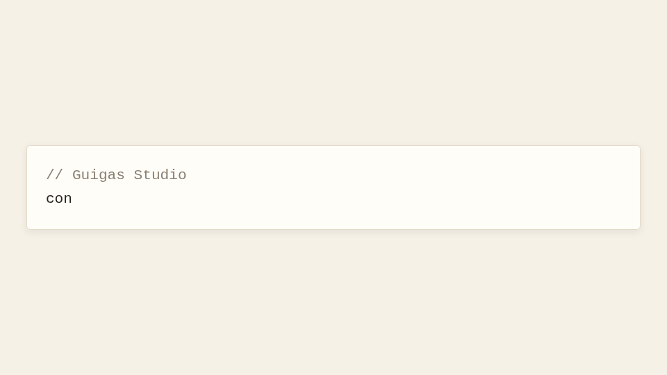
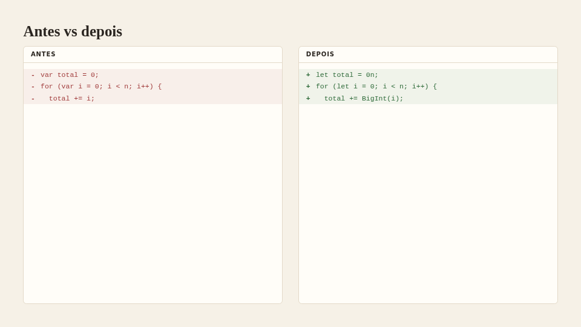
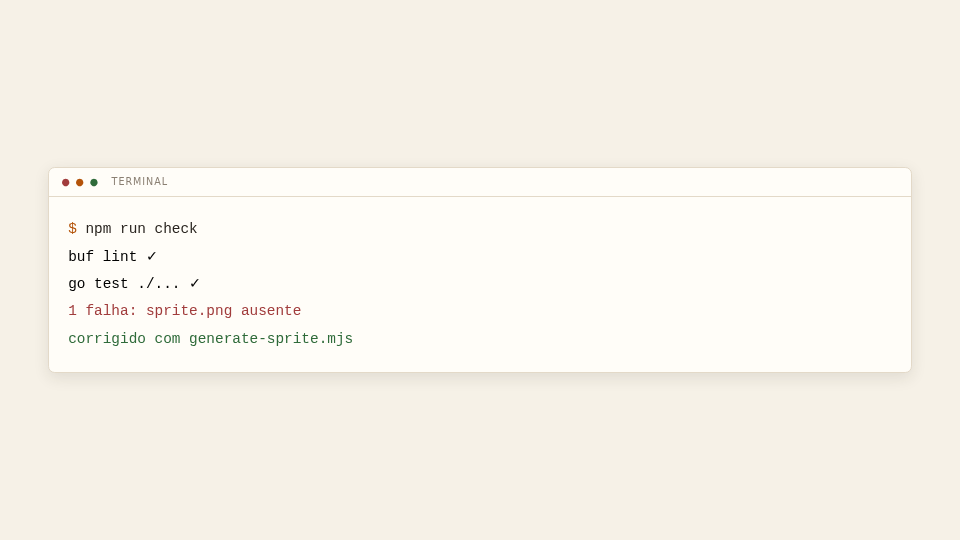
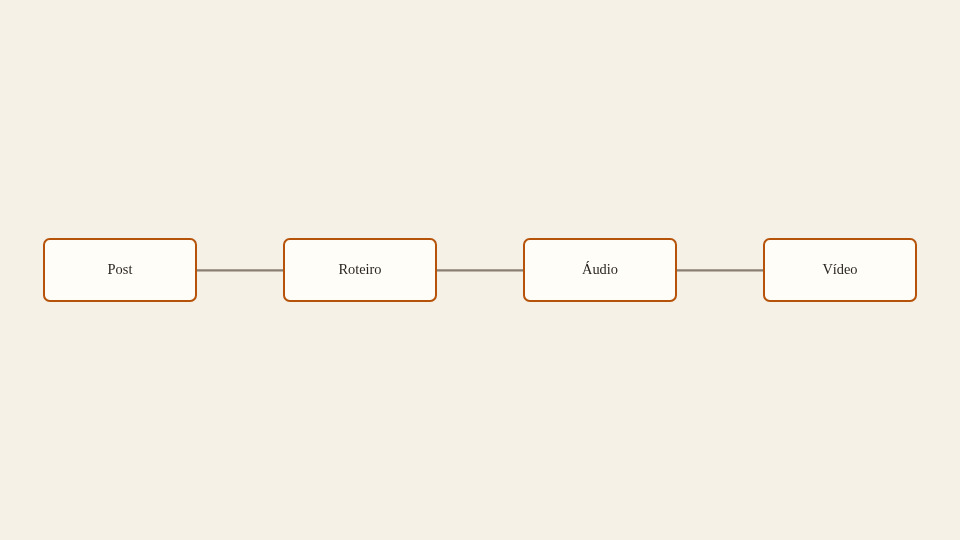
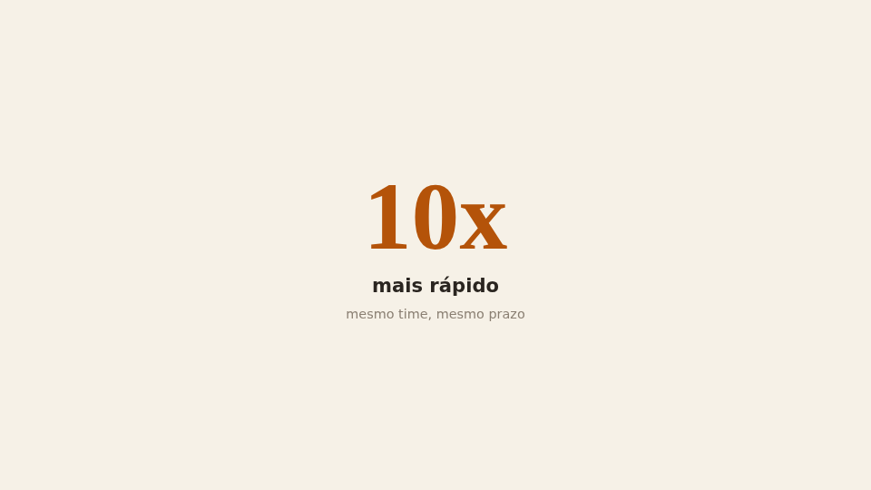
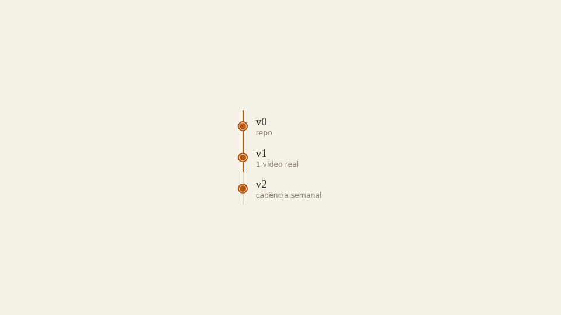

# Catálogo de cenas — gramática fechada

> Fonte de verdade executável: `remotion-kit/src/scenes/schema.ts` (Zod) e o
> JSON Schema gerado `remotion-kit/schema/scene-props.schema.json`. Este documento
> é a referência legível; em caso de divergência, o schema vence.

## Regras da gramática (SPEC §4.5)

1. **O agente só compõe props** — nunca CSS livre, cores ou fontes. Toda cor/fonte
   resolve dos design tokens do blog dentro do componente.
2. **Union fechada por `type`**: apenas os 7 tipos abaixo existem. Desejo fora deles vai
   para o backlog "kit estendido" (SPEC §8 #5), não vira exceção.
3. **Objetos estritos**: prop desconhecida = erro de validação (`unrecognized prop`).
4. **Forma no disco** = envelope do proto `SceneRef`: `{ "type": "...", "props": {...} }`.
5. Opcionais têm **defaults sensatos** aplicados no parse; o JSON Schema os declara
   para documentação, quem aplica é o `parseScene` no runtime.
6. Validação na entrada para `scenes_review` usa o mesmo schema (observador Go,
   S4-07) — mensagens apontam o caminho exato da props problemática
   (ex.: `nodes[2].label: required`).

---

## `code_typing`

Código digitado progressivamente com highlight, cursor piscando.

| Prop | Tipo | Default | Descrição |
| --- | --- | --- | --- |
| `code` | string | — (obrigatória) | Conteúdo do código, sem trim automático |
| `language` | string | `"typescript"` | Linguagem p/ highlight |
| `charsPerSecond` | number (>0) | `18` | Ritmo da digitação |

```json
{ "type": "code_typing", "props": { "code": "const x = 1;" } }
```



## `diff_view`

Antes/depois lado a lado com linhas removidas/adicionadas destacadas.

| Prop | Tipo | Default | Descrição |
| --- | --- | --- | --- |
| `title` | string? | — | Rótulo opcional acima do diff |
| `language` | string | `"typescript"` | Linguagem p/ highlight |
| `before` | string[] | — (obrigatória) | Linhas do estado anterior |
| `after` | string[] | — (obrigatória) | Linhas do estado novo |

```json
{
  "type": "diff_view",
  "props": { "before": ["var x = 1;"], "after": ["let x = 1;"] }
}
```



## `terminal_run`

Comandos executando linha a linha num terminal, com prompt e cursor.

| Prop | Tipo | Default | Descrição |
| --- | --- | --- | --- |
| `prompt` | string | `"$"` | Prefixo das linhas `command` |
| `lines` | `{text, kind?, delayFrames?}[]` | — (obrigatória, ≥1) | Linhas em ordem de execução |
| `cursor` | boolean | `true` | Cursor piscando na linha corrente |

Cada linha: `kind` ∈ `command` (digitado char a char) \| `output` \| `success` \|
`error`; `delayFrames` pausa ANTES da linha (acumulado).

```json
{
  "type": "terminal_run",
  "props": {
    "lines": [
      { "text": "npm run check", "kind": "command" },
      { "text": "✓ 0 erros", "kind": "success", "delayFrames": 20 }
    ]
  }
}
```



## `flow_diagram`

Diagrama de fluxo com nós e arestas animados na ordem declarada.

| Prop | Tipo | Default | Descrição |
| --- | --- | --- | --- |
| `nodes` | `{id, label, col?}[]` | — (obrigatória, ≥1) | Nós em grade de colunas fixas (`col` default 0) |
| `edges` | `{from, to}[]` | `[]` | Arestas dirigidas entre ids existentes |

Aresta referenciando id inexistente = erro apontando este catálogo.

```json
{
  "type": "flow_diagram",
  "props": {
    "nodes": [
      { "id": "a", "label": "Post", "col": 0 },
      { "id": "b", "label": "Vídeo", "col": 1 }
    ],
    "edges": [{ "from": "a", "to": "b" }]
  }
}
```



## `big_number`

Número gigante de impacto com rótulo e contexto opcional.

| Prop | Tipo | Default | Descrição |
| --- | --- | --- | --- |
| `value` | string | — (obrigatória) | O número (ex.: `"10x"`, `"42%"`) |
| `label` | string | — (obrigatória) | Rótulo curto abaixo do número |
| `context` | string? | — | Frase de apoio opcional |

```json
{ "type": "big_number", "props": { "value": "10x", "label": "mais rápido" } }
```



## `timeline`

Linha do tempo horizontal com marcos revelados em sequência.

| Prop | Tipo | Default | Descrição |
| --- | --- | --- | --- |
| `milestones` | `{label, detail?}[]` | — (obrigatória, ≥1) | Marcos na ordem temporal |

```json
{
  "type": "timeline",
  "props": { "milestones": [{ "label": "v1" }, { "label": "v2", "detail": "shorts" }] }
}
```



## `callout`

Caixa de destaque para avisos, armadilhas e confirmações.

| Prop | Tipo | Default | Descrição |
| --- | --- | --- | --- |
| `variant` | enum | — (obrigatória) | `info` \| `warning` \| `success` \| `danger` |
| `title` | string | — (obrigatória) | Título curto da caixa |
| `body` | string | — (obrigatória) | Texto do aviso |
| `icon` | string? | — | Nome do ícone opcional |

```json
{
  "type": "callout",
  "props": { "variant": "warning", "title": "Atenção", "body": "Rode o smoke antes." }
}
```


---

## Validando fora do runtime

```bash
npm run scenes:schema -w remotion-kit   # regenera schema/scene-props.schema.json
```

O observador Go valida cada `scene` contra esse arquivo na entrada para
`scenes_review` (S4-07). Para validar manualmente um JSON qualquer:

```bash
npx ajv-cli validate -s remotion-kit/schema/scene-props.schema.json --spec=draft2020 scene.json
```
